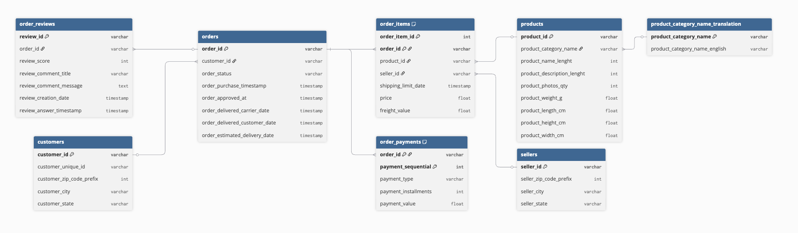

# Actividad clase 05 - Data Warehousing

## [Modelo de datos original](https://www.kaggle.com/datasets/olistbr/brazilian-ecommerce)

## Enlaces

* [Zip de datos](https://drive.google.com/file/d/1zwMpiP7pMolhgUCuhd-a64pFpnG-h8C1/view?usp=sharing)
* [Sandbox de BigQuery](https://docs.cloud.google.com/bigquery/docs/sandbox?hl=es-419)
* [Más ejemplos](https://alanezz.notion.site/Clase-03-Window-Functions-8300d89289f742ba81793445694dfed4) y [documentación](https://count.co/sql-resources/bigquery-standard-sql/window-functions-explained)

## Actividad

El objetivo de esta actividad es que analicen las consultas que deben responder, modelen los datos a un esquema que permita responder de forma eficiente a estas consultas y que tenga la suficiente flexibilidad para modificarse si queremos responder a otras preguntas. El modelo que construimos antes estaba pensado para las consultas del ejemplo, no para las de ahora.

### Modelado

Usando los CSVs entregados,

* Estudien si se deben realizar transformaciones de los datos para poder trabajarlos adecuadamente (normalizar)
* Diseñen un nuevo modelo que permita responder a las consultas
* Guarden los datos en nuevos CSV's que serán cargados en BigQuery

Sugerencias:

* `days_to_delivery = order_delivered_customer_date - order_purchase_timestamp` (cuidado si hay nulos)
* `size_category`:
  * Small: < 4,000 cm³,
  * Medium: 4,000 - 12,500 cm³
  * Large: > 12,500 cm³

### **Carga de datos**

* Iniciar sesión en BigQuery Sandbox usando alguna cuenta de Google
* Crear un nuevo proyecto
* Crear un nuevo conjunto de datos
* Cargar los CSV's en el conjunto de datos

### **Consumir**

Consultas a responder:

* ¿De dónde era y cuánto gasto el usuario con más compras? Repetir para el vendedor con más ventas
* ¿Para cada trimestre ([enero-marzo, abril-junio, ...]) del 2017, cual fue la categoría con mejor y peor valoración?
* Para cada estado del cliente (`customer_state`), muestra el ingreso total de cada categoría, pero añade una columna que muestre el ingreso total de todo el estado para comparar qué porcentaje aporta esa categoría al total regional
* Queremos el Top 5 de categorías de productos que más tardan en entregarse (`days_to_delivery`) en promedio
* Para un mes y año cualquiera, calcular ingresos acumulados, pero solo para productos considerados 'Large'
